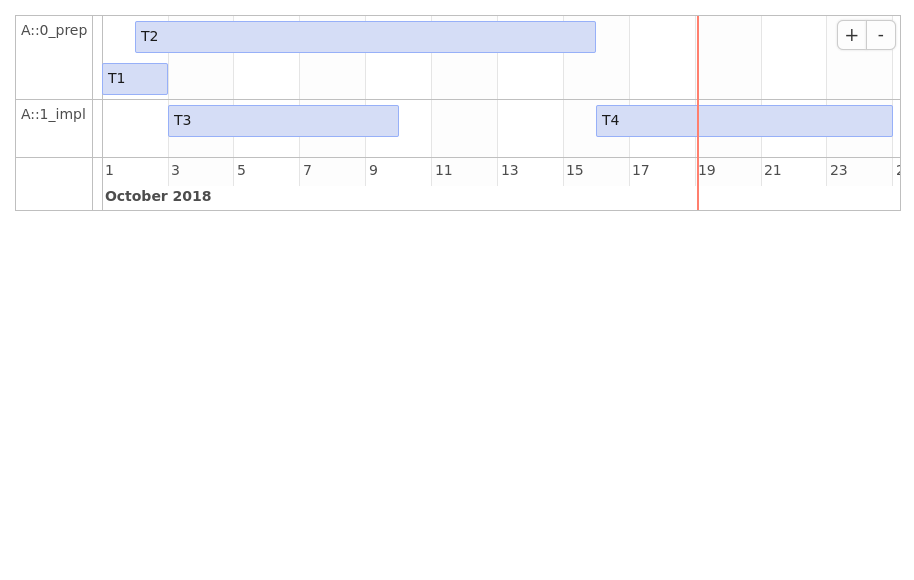

```{r, echo = FALSE}
knitr::opts_chunk$set(
  collapse = TRUE,
  comment = "#>",
  fig.path = "README-"
)
```

```{r badges, results='asis', echo=FALSE}
suppressPackageStartupMessages(library(badgecreatr))
cat(paste(badge_travis(ghaccount = "MarselScheer", ghrepo = "projectPlan", branch = "master"), ""))
cat(paste(badge_projectstatus(status = "wip"), ""))
cat(paste(badge_lifecycle(lifecycle = "experimental"), ""))
cat(paste(badge_license(), ""))
```

# projectPlan

The aim of the package is to calculate time lines for different task that may depend on each other.

## Example

Imagine a simple 4-task-plan, where 

* 1 task was already completed 
* 1 task started on *2018-10-02* where it is estimated that it will take 10 days to be completed
* 2 tasks are depending somehow on the first two tasks

```{r raw_plan, echo=FALSE}
library(data.table)
raw_plan <- data.table::rbindlist(
  list(
    data.table(
      project = "A",
      section = "0_prep",
      id = c("a", "b"),
      depends_on = NA,
      start = c("2018-10-01", "2018-10-02"),
      end = c("2018-10-03", "10"),
      resource = c("R1", "R2"),
      task = c("T1", "T2"),
      progress = c(100, 50),
      deadline = NA
    ),
    data.table(
      project = "A",
      section = "1_impl",
      id = c("c", "d"),
      depends_on = c("a", "a, b"),
      start = NA,
      end = c(5, 7),
      resource = c("R1", "R2"),
      task = c("T3", "T4"),
      progress = c(0, 0),
      deadline = c(NA, "2018-10-18")
    )
  )
)
suppressPackageStartupMessages(library(dplyr))
suppressPackageStartupMessages(library(projectPlan))
dummy <- futile.logger::flog.threshold(futile.logger::WARN)
```

```{r show_raw_plan}
raw_plan
```


Then using this package one can easily calculate when a task will start and be finished (excluding weekends).
If a deadline is unmet or a task is due today a warning is logged.

```{r plan}
plan <- 
  projectPlan::wrangle_raw_plan(raw_plan) %>% 
  projectPlan::calculate_time_lines()
```

```{r print_plan, echo=FALSE}
print(plan)
```

With the calculated time lines a gantt chart can be plotted

```{r gantt}
library(ggplot2)
projectPlan::gantt_by_sections(plan, show_dependencies = TRUE)
```

## Other packages for visualization

Once the time lines are calculated it is easy to leverage other visualization packages

```{r timevis, eval=FALSE}
plan %>%
  dplyr::mutate(
    id = 1:n(), content = task, start = as.character(time_start), end = as.character(time_end),
    group = as.numeric(as.factor(.$section))) %>%
  dplyr::select(id, content, start, end, project, section, group) %>%
  timevis::timevis(groups = distinct(data.frame(id = as.numeric(as.factor(.$section)), content = .$section)))
```



## Installation

You can install projectPlan from github with:

```{r gh-installation, eval = FALSE}
# install.packages("devtools")
devtools::install_github("MarselScheer/projectPlan")
```

