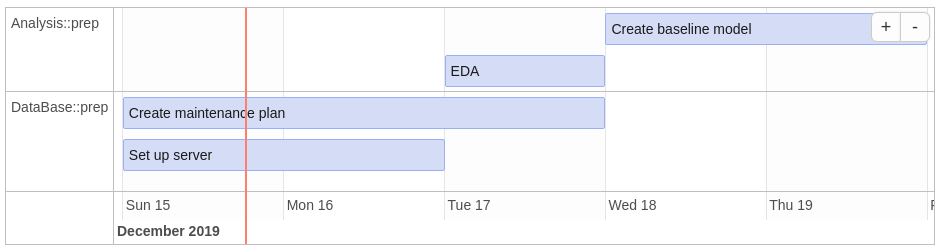

```{r, echo = FALSE}
knitr::opts_chunk$set(
  collapse = TRUE,
  comment = "#>",
  fig.path = "man/figures/README-"
)
```

```{r badges, results='asis', echo=FALSE}
suppressPackageStartupMessages(library(badgecreatr))
cat(paste(badge_travis(ghaccount = "MarselScheer", ghrepo = "projectPlan", branch = "master"), ""))
cat(paste(badge_projectstatus(status = "wip"), ""))
cat(paste(badge_lifecycle(lifecycle = "experimental"), ""))
cat(paste(badge_license(), ""))
```

# projectPlan

The aim of the package is to calculate time lines for different task that may depend on each other and
visualize the results in a Gantt-chart.

## Example

Imagine a simple 4-task-plan, where after the data base is ready
an exploratory data anlysis can be performed and based on that 
a first baseline model can be created.


```{r gantt, fig.width=12, echo=FALSE}
suppressPackageStartupMessages(library(data.table))
suppressPackageStartupMessages(library(dplyr))
suppressPackageStartupMessages(library(projectPlan))
logger::log_threshold(logger::ERROR, namespace = "projectPlan")

raw_plan <- dplyr::bind_rows(
 dplyr::tibble(
  project = c("Analysis"), 
  section = "prep", task = c("EDA", "Create baseline model"), id = c("eda", NA), start = "", depends_on = c("DataBase::server", "eda"), deadline = NA,
  est_duration = 1:2,
  progress = 0, 
  resource = "R1",
  status = NA,
  end = NA),
 dplyr::tibble(
  project = c("DataBase"), 
  section = "prep", task = c("Set up server", "Create maintenance plan"), id = c("server", NA), start = "TODAY", depends_on = "", deadline = c(NA, as.character(lubridate::as_date(lubridate::now())+5)),
  est_duration = 1:2,
  progress = 0, 
  resource = c("R2", "R3"),
  status = NA,
  end = NA)
) 
raw_plan %>% 
  projectPlan::wrangle_raw_plan() %>% 
  projectPlan::calculate_time_lines() %>% 
  projectPlan::gantt_by_sections(show_dependencies = TRUE)
```

Instead of calculating and ordering the tasks manually one only defines the tasks, its 
duration and the dependencies between them:

```{r show_raw_plan}
raw_plan %>% 
  dplyr::select(project, id, depends_on, task, start, est_duration)
```

Then using this package one can easily calculate when a task will start and be finished (excluding weekends).
If a deadline is unmet or a task is due today a warning is logged.

```{r plan}
plan <- 
  raw_plan %>% 
  projectPlan::wrangle_raw_plan() %>% 
  projectPlan::calculate_time_lines()
```

```{r print_plan, echo=FALSE}
plan %>% 
  dplyr::select(project, task, time_start, time_end, dist_end_to_deadline) %>% 
  dplyr::arrange(time_start)
```

With the calculated time lines a gantt chart can be plotted (see the initial plot) using:

```{r, eval=FALSE}
library(ggplot2)
projectPlan::gantt_by_sections(plan, show_dependencies = TRUE)
```

Note that the number of days the end date of a task is away from the corresponding deadline
is adjusted for weekends, for instance if it is planned that the task is done by Thrusday 
night and the deadline is on the following Monday, then there is one day left, i.e. Friday, 
before the deadline is reached.
The label attached to the vertical bar displays the distance in days from today to the next deadline.

## Other packages for visualization

Once the time lines are calculated it is easy to leverage other visualization packages (note that this is a screenshot that was created manually, therefore the timeline might be different from the initial plot)

```{r timevis, eval=FALSE}
plan %>%
  dplyr::mutate(
    id = 1:n(), content = task, start = as.character(time_start), end = as.character(time_end),
    group = as.numeric(as.factor(.$section))) %>%
  dplyr::select(id, content, start, end, project, section, group) %>%
  timevis::timevis(groups = distinct(data.frame(id = as.numeric(as.factor(.$section)), content = .$section)))
```



## Installation

You can install projectPlan from github with:

```{r gh-installation, eval = FALSE}
# install.packages("devtools")
devtools::install_github("MarselScheer/projectPlan")
```

