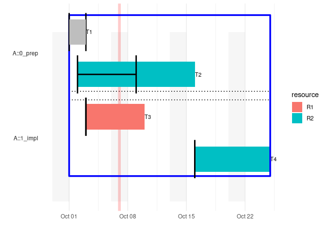

[](https://www.repostatus.org/#wip)
[](https://www.tidyverse.org/lifecycle/#experimental)
[](https://www.gnu.org/licenses/gpl-3.0.en.html)

# projectPlan

The aim of the package is to calculate time lines for different task
that may depend on each other.

## Example

Imagine a simple 4-task-plan, where

  - 1 task was already completed
  - 1 task started on *2018-10-03* where it is estimated that it will
    take 10 days to be completed
  - 2 tasks are depending somehow on the first two tasks

<!-- end list -->

``` r
raw_plan
#>    project section id depends_on      start        end resource task
#> 1:       A  0_prep  a       <NA> 2018-10-01 2018-10-03       R1   T1
#> 2:       A  0_prep  b       <NA> 2018-10-02         10       R2   T2
#> 3:       A  1_impl  c          a       <NA>          5       R1   T3
#> 4:       A  1_impl  d       a, b       <NA>          7       R2   T4
#>    progress deadline
#> 1:      100       NA
#> 2:       50       NA
#> 3:        0       NA
#> 4:        0       NA
```

Then using this package one can easily calculate when a task will start
and be finished (excluding weekends)

``` r
plan <- 
  projectPlan::wrangle_raw_plan(raw_plan) %>% 
  projectPlan::calculate_time_lines()

plan
```

And generate a gantt chart for it

``` r
library(ggplot2)
projectPlan::gantt_by_sections(plan)
```

<!-- -->

## Installation

You can install projectPlan from github with:

``` r
# install.packages("devtools")
devtools::install_github("MarselScheer/projectPlan")
```
