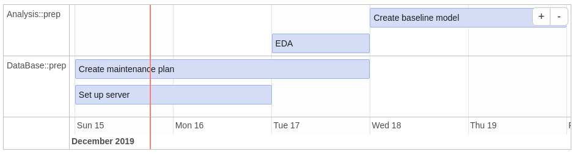

[](https://travis-ci.org/MarselScheer/projectPlan)
[](https://www.repostatus.org/#wip)
[](https://www.tidyverse.org/lifecycle/#experimental)
[](https://www.gnu.org/licenses/gpl-3.0.en.html)

# projectPlan

The aim of the package is to calculate time lines for different task
that may depend on each other and visualize the results in a
Gantt-chart.

## Example

Imagine a simple 4-task-plan, where after the data base is ready an
exploratory data anlysis can be performed and based on that a first
baseline model can be created.

<!-- -->

Instead of calculating and ordering the tasks manually one only defines
the tasks, its duration and the dependencies between them:

``` r
raw_plan %>% 
  dplyr::select(project, id, depends_on, task, start, est_duration)
#> # A tibble: 4 x 6
#>   project  id     depends_on       task                  start est_duration
#>   <chr>    <chr>  <chr>            <chr>                 <chr>        <int>
#> 1 Analysis eda    DataBase::server EDA                   ""               1
#> 2 Analysis <NA>   eda              Create baseline model ""               2
#> 3 DataBase server ""               Set up server         TODAY            1
#> 4 DataBase <NA>   ""               Create maintenance p… TODAY            2
```

Then using this package one can easily calculate when a task will start
and be finished (excluding weekends). If a deadline is unmet or a task
is due today a warning is logged.

``` r
plan <- 
  raw_plan %>% 
  projectPlan::wrangle_raw_plan() %>% 
  projectPlan::calculate_time_lines()
```

    #>    project                    task time_start   time_end
    #> 1 DataBase           Set up server 2019-12-17 2019-12-18
    #> 2 DataBase Create maintenance plan 2019-12-17 2019-12-19
    #> 3 Analysis                     EDA 2019-12-18 2019-12-19
    #> 4 Analysis   Create baseline model 2019-12-19 2019-12-23
    #>   dist_end_to_deadline
    #> 1              NA days
    #> 2               2 days
    #> 3              NA days
    #> 4              NA days

With the calculated time lines a gantt chart can be plotted (see the
initial plot) using:

``` r
library(ggplot2)
projectPlan::gantt_by_sections(plan, show_dependencies = TRUE)
```

Note that the number of days the end date of a task is away from the
corresponding deadline is adjusted for weekends, for instance if it is
planned that the task is done by Thrusday night and the deadline is on
the following Monday, then there is one day left, i.e. Friday, before
the deadline is reached. The label attached to the vertical bar displays
the distance in days from today to the next deadline.

## Other packages for visualization

Once the time lines are calculated it is easy to leverage other
visualization packages (note that this is a screenshot that was created
manually, therefore the timeline might be different from the initial
plot)

``` r
plan %>%
  dplyr::mutate(
    id = 1:n(), content = task, start = as.character(time_start), end = as.character(time_end),
    group = as.numeric(as.factor(.$section))) %>%
  dplyr::select(id, content, start, end, project, section, group) %>%
  timevis::timevis(groups = distinct(data.frame(id = as.numeric(as.factor(.$section)), content = .$section)))
```



## Installation

You can install projectPlan from github with:

``` r
# install.packages("devtools")
devtools::install_github("MarselScheer/projectPlan")
```
