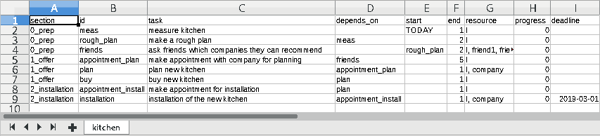

```{r setup, include = FALSE}
knitr::opts_chunk$set(
  collapse = TRUE,
  comment = "#>"
)
futile.logger::flog.threshold(futile.logger::WARN)

library(projectPlan)
suppressPackageStartupMessages(library(dplyr))
library(DT)
```

# Introduction

A VERY simplified scene is the following.

* Peter: "How long will it take to realize 'this' and 'that'?" 
* Bob: "With enough resources our department maybe need 3 months. But other departments will need to be involved!" 
* Peter: "OK. Can you make a timeline for that?"
* Bob: "Give me an hour. I create a rough version."

Bob starts making a rough plan containg 10 major chunks, estimated durations and assign resources for those chunks 
and thinks about dependencies between the chunks.

One hour later ...

* Bob: "I am done, but I have no idea if customer service needs to prepare a training and how long this will take. Furthermore, 
production needs to make some changes, too."
* Peter: "Lets discuss this in the next head meeting."

The outcome of the head meeting is that the project should be realized, but there are some restriction: 

* customer service must complete the training before launch
* the production team cannot start before they finished another project

The next step is adding this information to the plan and start refining the 10 major chunks. Once the project starts you start keep 
track of the tasks, i.e. the actual start time, progress, end time. You add other things that might pop up or you dont want to forget 
during the project.

During all phases this package could be helpful. For this vignette we try to work through a simple project hopefully every can grasp, 
i.e. replace an old kitchen in a household with a new one.

# A Simple plan grows

## Planning

We start with a simple list

* measure kitchen
* make a rough plan
* check if friends can recommend a company
* make an appointment for the planning
* plan the new kitchen with the company
* buy/pay the new kitchen
* make an appointment for installation
* install new kitchen

It is easy to see that there are already some dependencies. For instance, no one will install our new kitchen if did not paid for it! 
Depending on how rough the plan is, we might need to measure the kitchen first. So we open up LibreOffice Calc enter every point in one 
row and save it as xlsx-file. So the usual workflow is to edit the plan for instance using LibreOffice Calc, import the plan with R and 
let R do the caclualtions. 

We create the following spreadsheet: 


A few notes on the columns in the spreadsheet (more details later): 

* section is used just to get a bit more structure into the tasks
* id is used identify a task (to be used in depends_on-columns)
* task is clear
* depends_on defines dependencies, for instance we need to measure the kitchen before we make new (rough) plan for the kitchen
* start can be 
    - TODAY (this is substitute by the current date) or 
    - an id (for instance, we can ask our friends at any time but we decided to do this after we made our rough plan. So this is not a dependency! We just planned to do it after a certain task)
    - a date (yyyy-mm-dd) when the task actually was started
* est_duration is the estimated duration in days. 
* end is end date (yyyy-mm-dd) of the task. Usually known when the task was completed or aborted. 
* status can be empty or contain the special terms AWAIT, UNSCHEDULED or ABORTED. 
* resource can be a comma separated list
* progress is a number between 0 and 100
* deadline is a date
* other columns are ignored by *projectPlan*

*projectPlan::import_xlsx* will import ALL sheets and use the sheet name as the project name. The sheet name will be ignored if one has 
a column *project*. Note, that the deadline for the last task (installation of the new kitchen) in the screenshot is fixed, 
while in the following will be dynamically about 3 month in the future.

```{r, eval=FALSE}
raw_plan <- projectPlan::import_xlsx("projects.xlsx")
```
```{r echo=FALSE}
raw_plan <- structure(list(
  section = c(
    "0_prep", "0_prep", "0_prep", "1_offer",
    "1_offer", "1_offer", "2_installation", "2_installation"
  ), id = c(
    "meas",
    "rough_plan", "friends", "appointment_plan", "plan", "buy", "appointment_install",
    "installation"
  ), task = c(
    "measure kitchen", "make a rough plan",
    "ask friends which companies they can recommend", "make appointment with company for planning",
    "plan new kitchen", "buy new kitchen", "make appointment for installation",
    "installation of the new kitchen"
  ), depends_on = c(
    NA, "meas",
    NA, "friends", "appointment_plan", "plan", "plan", "appointment_install"
  ), start = c("TODAY", NA, "rough_plan", NA, NA, NA, NA, NA),
  end = c("", "", "", "", "", "", "", ""), 
  est_duration = c(1, 2, 2, 5, 1, 1, 1, 1),
  status = c("", "", "", "", "", "", "", ""), 
  resource = c(
    "I", "I", "I, friend1, friend2",
    "I", "I, company", "I", "I", "I, company"
  ), progress = c(
    0,
    0, 0, 0, 0, 0, 0, 0
  ), deadline = structure(c(NA, NA, NA, 
    NA, NA, NA, NA, as.numeric(Sys.Date()) + 90), class = "Date"), project = c(
    "kitchen", "kitchen", "kitchen",
    "kitchen", "kitchen", "kitchen", "kitchen", "kitchen"
  )
), row.names = c(
  NA,
  -8L
), class = c("data.table", "data.frame"))
```


Now we can easily calculate explicit timelines for the tasks

```{r}
plan <- raw_plan %>% 
  projectPlan::wrangle_raw_plan()

timelines <- plan %>% 
  projectPlan::calculate_time_lines()

timelines %>% 
  dplyr::select(task, resource, time_start, time_end, dist_end_to_deadline) %>% 
  dplyr::arrange(time_start) %>% 
  DT::datatable()
```

We can also easily visualize the timelines. Note, the *separate_rows* calls to get one row for every resource in the timeline:

```{r, fig.width=10, fig.height=7}
timelines %>% 
  tidyr::separate_rows(resource) %>% 
  projectPlan::gantt_by_sections(show_dependencies = TRUE)
```

## Work in progress

```{r echo=FALSE}
project_start <- lubridate::as_date(lubridate::now()) - 21
raw_plan$start[1] = as.character(project_start)
raw_plan$end[1] = as.character(project_start + 1)

raw_plan$start[2] = as.character(project_start + 1)
raw_plan$end[2] = as.character(project_start + 6)

raw_plan$start[3] = as.character(project_start + 6)
raw_plan$end[3] = as.character(project_start + 7)
raw_plan$progress[1:3] = 100

raw_plan$start[4] = as.character(project_start + 12)
raw_plan$status[4] = "AWAIT"
raw_plan$task[4] = "make appointment with Life&Cook.\nWAIT for Mrs. Gray (sick leave) to call back."
raw_plan$progress[4] = 50
```

Let's look at an updated version of the project plan:

```{r}
DT::datatable(raw_plan)
```

This plan shows that we started 3 week ago and we updated the spreadsheet over the time. We already completed 
the first three tasks. But making a rough plan took us 4 days instead of the planned 2 days.

We already know that we want to contact the company *Life&Cook* but we were not able to call the 
company for a few days and therefore the project plan shows a gap between "ask friends ..." and 
"make appointment ...". Furthermore, one of our friend told us that we should make the appointment 
with Mrs. Gray because he knows her personally and is convinced that she will make a fair offer. Unfortunately 
we have to wait until she calls back because she currently is on sick leave, therefore this task 
has status *AWAIT*. Note, if the estimated end of the task is in the past but status is *AWAIT*, then end of the
task is automatically set to today. We set the progress 
for the task "make appointment" to *50* to indicate the we already started the task. Instead of 
reformulate the task for the appointment one could simply add a comments column to the spreadsheet. 
Currently such a comments column is ignored by *projectPlan*. However, a deadline is automatically 
created for a task in status *AWAIT*, where the estimated end of the task (which is today if the 
estimated end is in the past) is used as the date for
the deadline. Of course, an existing deadline will not be modified. The corresponding gantt-chart is:

```{r, fig.width=12, fig.height=7}
raw_plan %>% 
  projectPlan::wrangle_raw_plan() %>% 
  projectPlan::calculate_time_lines() %>% 
  tidyr::separate_rows(resource) %>% 
  projectPlan::gantt_by_sections(show_dependencies = TRUE)
```

## Incorporate another project plan

```{r, echo = FALSE}
raw_plan$start[4] <- as.character(project_start + 12)
raw_plan$end[4] <- as.character(project_start + 18)
raw_plan$progress[4] <- 100

raw_plan$start[5] <- as.character(project_start + 18)
raw_plan$end[5] <- as.character(project_start + 19)
raw_plan$progress[5] <- 100

raw_plan$start[6] <- as.character(project_start + 20)
raw_plan$end[6] <- as.character(project_start + 21)
raw_plan$progress[6] <- 100

raw_plan$start[7] <- as.character(project_start + 20)
raw_plan$end[7] <- as.character(project_start + 21)
raw_plan$progress[7] <- 100

raw_plan$start[8] <- as.character(project_start + 80)
raw_plan$end[8] <- as.character(project_start + 81)
raw_plan$task[8] <- "INSTALLATION. APPOINTMENT CONFIRMED BY LIFE&COOK"
raw_plan$depends_on <- ""

dispose_note <- raw_plan[8]
dispose_note$id <- "dispose_note"
dispose_note$task <- "note to Life&Cook (1 week before installation) if they should dispose the kitchen"
dispose_note$start <- NA
dispose_note$end <- NA
dispose_note$deadline <- lubridate::as_date(raw_plan$start[8]) - 7 
dispose_note$depends_on <- "sell_kitchen::sell"
raw_plan <- 
  dplyr::bind_rows(raw_plan[1:7], dispose_note, raw_plan[8])
```


Assume that we already planned our new kitchen with Mrs. Gray and we already have an appointment for the
installation of the new kitchen on `r raw_plan[id == "installation"]$start`. 
*Life&Cook* can dispose the old kitchen for us but we would 
have to pay for that. So we try to sell the kitchen but at least one week before the installation 
*Life&Cook* need to know if they have to dispose the old kitchen for us. So the new plan is:

```{r, echo=FALSE}
DT::datatable(raw_plan)
```

Note that row `r which(raw_plan$id == "dispose_note")` has no explicit start or end date. 
It has only a deadline one week before installation and the dependency *sell_kitchen::sell*. 
The latter is a cross-project-dependency. We will create the project *sell_kitchen* in the next step.

In order to show a bit more of the package-functionality we create a new project for selling the old kitchen.
The new project will be located in a separate spreadsheet with the name *sell_kitchen* and contains two sections.
Note the first *depends_on* entry, i.e. *kitchen::appointment_install*, which again is a cross-project-dependency.


```{r, echo=FALSE}
#sell_kitchen <- projectPlan::import_xlsx("projects.xlsx") %>% dplyr::filter(project == "sell_kitchen")
sell_kitchen <- structure(list(
  section = c("0_prep", "0_prep", "0_prep", "1_pickup"), id = c("pictures", "offer", "tours", "sell"), task = c(
    "make pictures of kitchen",
    "offer kitchen on various internet platforms", "placeholder for tours with potential buyers",
    "get paid and pick up of the kitchen"
  ), depends_on = c(
    "kitchen::appointment_install",
    "pictures", "offer", "tours"
  ), start = c(
    NA_character_, NA_character_,
    NA_character_, NA_character_
  ), 
  end = c("", "", "", ""),
  est_duration = c(1, 1, 30, 1), 
  status = c("", "", "", ""),
  resource = c(
    "I",
    "I", "I", "I, buyer"
  ), progress = c(0, 0, 0, 0), deadline = structure(c(
    NA_real_,
    NA_real_, NA_real_, NA_real_
  ), class = c("POSIXct", "POSIXt"), tzone = "UTC"),
  project = c(
    "sell_kitchen", "sell_kitchen", "sell_kitchen",
    "sell_kitchen"
  ), comments = c(NA, NA, NA, NA)
), class = "data.frame", row.names = c(
  NA,
  -4L
))
DT::datatable(sell_kitchen)
```

Importing the xlsx-file (every project in a separate sheet) will result in a raw plan
containing all projects. Hence, we can easily calculate timeline taking all projects
and there possible dependencies into account: 

```{r, fig.width=15, fig.height=7}
tmp_time_lines <- raw_plan %>%
  dplyr::bind_rows(sell_kitchen) %>% 
  projectPlan::wrangle_raw_plan() %>%
  projectPlan::calculate_time_lines()

tmp_time_lines %>%
  tidyr::separate_rows(resource) %>%
  projectPlan::gantt_by_sections(show_dependencies = TRUE)
```

The gantt-chart now easily reveals that if the project *sell_kitchen* goes as planned,
then we can inform *Life&Cook* `r as.numeric(tmp_time_lines[id == "kitchen::dispose_note"]$dist_end_to_deadline)` days 
before we reach the last time when we can hire life&cook to dispose our kitchen.